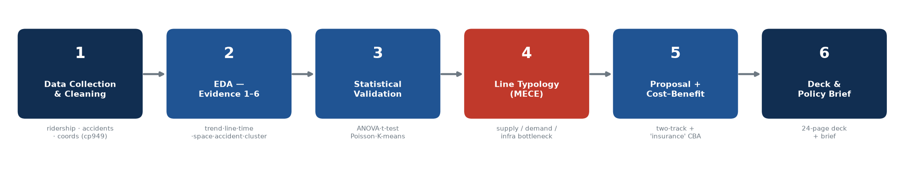
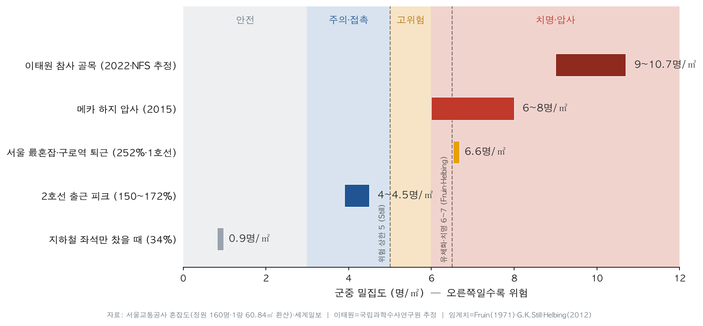
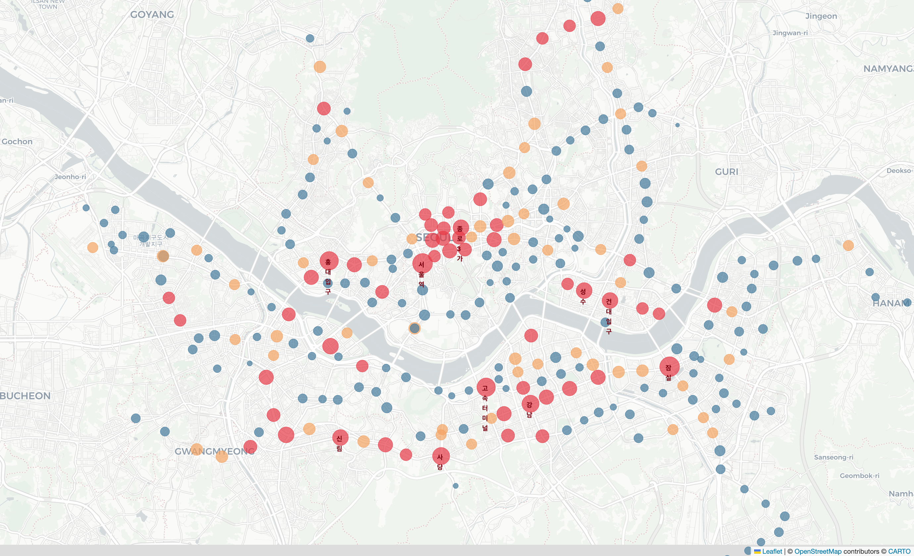

# Seoul Subway Congestion & Accident Analysis — Policy Proposal

> **"Congestion and accidents pile up in the same place."**
> An analysis of Seoul Metro Lines 1–9 — ridership plus five years of accident records — that pinpoints the **most dangerous congestion-vulnerable points when an accident occurs**, and turns the evidence into a **policy proposal with a concrete Action Plan** for decision-makers (Seoul Metro · National Assembly Land & Transport Committee).

`Scope: Seoul Lines 1–9` · `Data: 2015–2026` · `Audience: policymakers`

## Project Overview
| Item | Detail |
|---|---|
| Host | Yeardream School, 6th cohort (이어드림스쿨 6기) |
| Team | Online Team 9 (비대면 9팀) |
| Members | Im Jong-won · Park Sang-jin · Yoon Eun-mi (3) |
| Period | 2026-06-25 – 06-26 (2 days), fully online |
| Topic | Seoul subway congestion & accident analysis to policy proposal (SCQA · Action Plan) |
| Audience | Policymakers (Seoul Metro · National Assembly Transport Committee) |
| Deliverables | Presentation deck [`.pptx`](발표장표_지하철혼잡.pptx) / [`.pdf`](발표장표_지하철혼잡.pdf) · Analysis notebook [`.ipynb`](notebooks/지하철_혼잡도_분석.ipynb) |
| Stack | Python (pandas · scipy · statsmodels · scikit-learn · matplotlib · folium) · Statistics (ANOVA · t-test · η² · Tukey · Poisson regression · K-means) · Minto SCQA / Pyramid · Wilke visualization |

## Analysis Roadmap

## Key Findings
| # | Evidence | Finding |
|---|---|---|
| 1 | Ridership trend | COVID −27% drop, then 91% rebound by 2024 |
| 2 | By line · typology | Line 2 dominates (t-test · ANOVA); MECE typology by bottleneck — Line 9 = demand-forecast failure / supply shortage |
| 3 | Time of day | Twin peaks — morning alighting at 08:00, evening boarding at 18:00 |
| 4 | Spatial concentration | Top 10% of stations carry 28.5% of all ridership (CBD · Gangnam) |
| 5 | Accidents (key evidence) | 08:00 peak, 34.4% during rush hours (raw count 2.65×; about 1.3× after exposure adjustment — the point is overlap impact, not raw frequency); +81% over five years |
| 6 | Station types (K-means) | Three types — business, residential, all-day — enabling tailored measures |

**Conclusion.** Congestion has **different root causes by line**, so the answer is **type-specific prescriptions**, classified on a single MECE axis (the dominant bottleneck location):

- **A. Structural overload — supply bottleneck** (Lines 2, 9) — expand supply: longer trainsets, tighter headways, signaling upgrades
- **B. Time and direction skew — demand bottleneck** (Lines 3, 4, 6, 7, 8) — spread demand: staggered hours, off-peak pricing
- **C. Transfer load and aging — infrastructure bottleneck** (Lines 1, 5) — renew infrastructure: signals, rolling stock, transfer flow

Prevention reads as insurance: a roughly 4.7 trillion KRW program (mostly already budgeted) is offset by Seoul's annual subway congestion cost (~725 billion KRW) plus the damage from recurring accidents and service disruptions. The widely cited 81.3 trillion KRW figure is the national **road** congestion cost (KOTI, 2023; subway excluded), so it is macro context — not the amount this plan saves.

**Safety benchmark.** Line 2 at rush hour reaches roughly **3.9–4.5 people/m²** — about twice the event-safety limit of 2/m², with the worst segment at 6.6/m². On the same scale, the Itaewon crowd crush is estimated at 9–10.7/m² (National Forensic Service). At this density, an accident can trigger crowd-crush dynamics. Thresholds follow Fruin (1971), G. K. Still, and Helbing (2012).

## Key Visuals
| Crowd density (people/m²): everyday congestion vs. crush disasters | Congestion map (folium, real basemap) |
|:---:|:---:|
|  |  |

*Charts are labeled in Korean — the analysis and deck target a Korean policy audience.*

## Methodology & Evaluation Criteria
**Framework:** Minto SCQA / Pyramid Principle · descriptive and inferential statistics (ANOVA, effect size η², Tukey, Poisson regression) · K-means clustering · Claus Wilke visualization principles, leading to a proposal and Action Plan.

The project was graded against four criteria; the table below shows how each was addressed.

| Criterion | How it was addressed |
|---|---|
| SCQA — frame the analysis problem | SCQA plus an "Analysis Design" slide stating Situation, Complication, Question, and Answer |
| Pyramid evidence — statistics (t-test, ANOVA, regression) | Evidence 1–6 supported by t-test (t = 5.18), ANOVA (η² = .28, Tukey), Poisson regression, and K-means, organized with MECE grouping |
| Visualization | Eight Wilke-style charts, a folium map on a real basemap, and a crowd-density comparison |
| Action Plan (So What?) | Line-type-specific prescriptions, a two-track split between operator and legislator, and a sourced budget with cost–benefit ("insurance") reasoning |

## Repository Structure
| Path | Contents |
|---|---|
| [`발표장표_지하철혼잡.pptx`](발표장표_지하철혼잡.pptx) · [`.pdf`](발표장표_지하철혼잡.pdf) | **Final deck** — 24 body slides (plus a 5-page appendix, excluded from the page limit; `n/24` numbering). Policy-report styling (navy and gray, Apple SD Gothic Neo), diagonal hero cover, section dividers, one-page impact summary, analysis design (pyramid), line typology (MECE, A/B/C bottleneck), crowd-density comparison, cost-versus-damage CBA, embedded news clip, field video, folium map. Appendix: aging infrastructure, overseas cases, FOI request, alternative comparison |
| [`notebooks/지하철_혼잡도_분석.ipynb`](notebooks/지하철_혼잡도_분석.ipynb) | **Analysis notebook (source code)** — Evidence 1–6, line typology (with a MECE assertion), and statistics (t-test, ANOVA, η², Tukey, Poisson, K-means); reproducible on Colab |
| `data/` · root `…ridership.csv` | Raw data — time-of-day ridership, station coordinates, five-year accident records (CSV / XLSX, cp949) |
| `charts/` | Eight analysis charts, the crowd-density comparison (`안전_밀집도비교.png`), and the folium congestion map (`지하철_혼잡_지도.html` → `근거4_folium지도.png`) |
| `영상/` | Field video (filmed by the team, 1.5×) and a news montage (archive); the deck embeds an SBS news clip |
| `assets/` | Cover hero images (Unsplash, Pexels; free license) and the analysis roadmap diagram |
| `docs/` | Problem definition, proposal and action plan, data-collection spec, FOI draft, meeting brief |
| `docs/research/` | Research notes, density-comparison sources, policy-feasibility review, textbook application (all source-cited) |
| Root reports | Team notes — line-by-line congestion causes, accident data, accident news cases, policy cases, model-answer analysis |
| Reference PDFs | Seoul Institute, "subway congestion causes and measures"; KOTI, "traffic congestion cost (2023)" |
| `scripts_build_deck.js` · `scripts_fix_rels.py` | Deck build (pptxgenjs) and a `.rels` ampersand-escape fix |

## How to Reproduce
1. Open `notebooks/지하철_혼잡도_분석.ipynb` in Colab.
2. Upload the data — files in `data/` plus the root `…ridership.csv` (main dataset). The notebook's `D()` helper resolves paths automatically.
3. Run the Korean-font install cell, then run all cells.

> Note: CSV files use cp949 encoding — `pd.read_csv(..., encoding='cp949')`.

## Data Sources
- **Seoul Open Data Plaza** — ridership by line, station, and time of day (main dataset)
- **data.go.kr (Public Data Portal)** — urban-rail station coordinates, Seoul Metro five-year accidents (2,837), congestion rate (%)
- **KOTI / Seoul Institute** — traffic congestion cost (2023, national road, subway excluded); "subway congestion causes and measures" report
- **Line typology and Line 9** — Seoul Metro congestion rate (express 195%), Line 9 demand controversy, a KCI paper on the cost-effectiveness of Line 9 congestion improvement, and team line-by-line notes
- **Crowd density (people/m²)** — National Forensic Service (Itaewon estimate); Fruin (1971), G. K. Still, and Helbing (2012) thresholds; Seoul Metro car capacity (160 per car, 60.84 m²); Seoul subway congestion cost of 725 billion KRW (2016, Seoul Economic Daily)
- **Accident cases** — Sangwangsimni rear-end collision (2014; Wikipedia, NFS); YTN, MBC, Newsis, and Yonhap reports (team accident-news notes)
- **FOI request (in progress)** — Seoul Metro, receipt no. 16931975 (filed 2026-06-25, reply expected 07-08): car-level congestion, Line 9, disruption impact, and aging-facility / congestion budgets

## License & Notes
- Documents, code, and the deck authored by the team are released under the [MIT License](LICENSE).
- Not covered by MIT (rights held by the originators):
  - Textbook PDFs (Wilke, Field, ISLP, Minto) — respective publishers and authors
  - `02_데이터분석프로젝트/` lecture materials — Yeardream School / instructor
- This repository is private. Before making it public, remove the copyrighted materials above, any personal information in screenshots (contact numbers), and faces in the field video.
